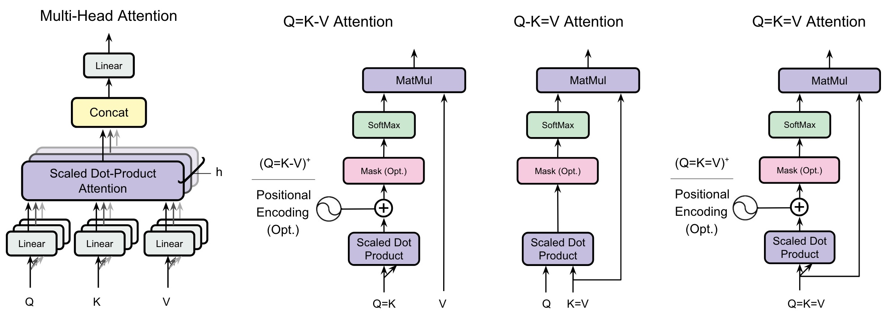

# Do Transformers Need Three Projections?

Official code release for the ICML 2026 paper:

**Do Transformers Need Three Projections? A Systematic Study of QKV Variants**  
Ali Kayyam, Anusha Madan Gopal, M Anthony Lewis (BrainChip Inc.)  
*Proceedings of the 43rd International Conference on Machine Learning, Seoul, South Korea. PMLR 306, 2026.*

\[[paper](<paper-url>)\] · \[[OpenReview](<openreview-url>)\]

## Overview

We systematically evaluate three projection-sharing variants of standard self-attentifon:

- **Q=K–V**: shared query and key, separate value (symmetric attention)
- **Q–K=V**: separate query, shared key and value (asymmetric, **our headline result**)
- **Q=K=V**: single projection for all three roles

Across 12 tasks spanning synthetic reasoning, vision (MNIST, CIFAR, TinyImageNet, anomaly detection, segmentation), and language modeling (300M and 1.2B parameter LMs on SlimPajama), we find that **Q–K=V achieves a 50% KV cache reduction with only ~3% perplexity degradation**. Combined with head sharing, Q-MQA achieves 96.9% cache reduction at the 300M scale.

This repository contains the code and configurations for the **language modeling experiments** at 300M and 1.2B parameter scales.

## Variant → file mapping

The training script for each variant lives in a separate file. Class names and CLI flags use compact aliases (e.g. `kv` for the K=V winner) that don't always match the paper's notation — use this table to translate.

| Paper notation | Description | File (300M) | File (1.2B) | Class name |
|---|---|---|---|---|
| **QKV** | Standard attention (baseline) | `transformer_KQV_300_M.py` | `transformer_KQV_1_2B.py` | `GPT` |
| **Q=K–V** | Shared Q and K, separate V | `transformer_QK_300_M.py` | — | `GPT_KV` |
| **Q–K=V** ⭐ | Separate Q, shared K and V | `transformer_KV_1_300_M.py` | `transformer_KV_1_1_2B.py` | `GPT_QKV_KEqualsV` |
| **Q=K=V** | Single projection | `transformer_K_300_M.py` | — | `GPT_K` |
| **GQA-4 / GQA-8** | Grouped Query Attention | `transformer_GQA_300_M.py` | `transformer_GQA_1_2B.py` | `GPT_GQA` |
| **MQA** | Multi-Query Attention | `transformer_MQA_300_M.py` | `transformer_MQA_1_2B.py` | `GPT_MQA` |
| **Q-GQA** | Q–K=V combined with GQA | `transformer_QGQA_300_M.py` | `transformer_QGQA_1_2B.py` | `GPT_Q_GQA` |
| **Q-MQA** | Q–K=V combined with MQA | `transformer_QMQA_300_M.py` | `transformer_QMQA_1_2B.py` | `GPT_QMQA` |

⭐ `Q–K=V` is the paper's headline result (Section 3.3.1, Table 4, Table 10).

Q=K–V and Q=K=V were only run at 300M scale — they were excluded from 1.2B experiments because they were dominated by Q–K=V at smaller scale (see paper Section 3.3).

## Repository structure

```
.
├── transformer_*_300_M.py        Training scripts (300M scale, one per variant)
├── transformer_*_1_2B.py         Training scripts (1.2B scale)
├── configs/
│   ├── model_config_300M.yaml    Architecture hyperparameters
│   ├── model_config_1.2B.yaml
│   ├── train_config_300M.yaml    Optimizer/schedule hyperparameters
│   └── train_config_1.2B.yaml
├── dataset_download.py           Streams + chunks SlimPajama to disk
├── run_eval.py                   Downstream task eval (HellaSwag, PIQA, ARC, Winogrande)
├── analysis_computation_profiler.py   Theoretical MACs vs profiled FLOPs
├── comprehensive_flop_analysis_300M.json   Output of analysis script
├── requirements.txt
├── LICENSE
└── README.md
```

## Installation

```bash
pip install -r requirements.txt
```

`flash-attn` is optional. The training scripts have a `use_flash_attention` flag in the model config; set it to `false` if `flash-attn` isn't available in your environment.

## Reproducing the paper

### 1. Download data

```bash
python dataset_download.py
```

By default this downloads ~10B tokens of SlimPajama train and 10M tokens of validation to `./slimpajama_data/`. Adjust `target_tokens` in the script's `__main__` block to download more or less.

Note: the full download is ~30GB. Make sure you have disk space.

### 2. Train

Paper experiments were run on **8 × NVIDIA A100 40GB GPUs** with distributed data parallel and bfloat16 mixed precision. To launch a training run:

```bash
# 300M scale — Q–K=V (our winner)
torchrun --nproc_per_node=8 transformer_KV_1_300_M.py

# 1.2B scale — same variant
torchrun --nproc_per_node=8 transformer_KV_1_1_2B.py

# Other variants follow the same pattern, e.g.
torchrun --nproc_per_node=8 transformer_KQV_300_M.py   # QKV baseline
torchrun --nproc_per_node=8 transformer_GQA_300_M.py   # GQA-4 (300M)
torchrun --nproc_per_node=8 transformer_MQA_1_2B.py    # MQA (1.2B)
```

**If you have a different GPU count:** the configs target an effective batch size of `micro_batch_size × gradient_accumulation × num_gpus × seq_length`. To keep the same effective batch on a different GPU count, scale `gradient_accumulation` inversely with GPU count.

**Training time estimates** (8 × A100 40GB):
- 300M to 10B tokens: ~24 hours
- 1.2B to 8.85B tokens: ~3 days

Checkpoints are saved every 1,000 steps to `./outputs_<variant>/` or `./outputs_1.2B_<variant>/`.

### 3. Evaluate

**Validation perplexity** (Tables 4 and 10) is computed by the training script's internal `evaluate` function during training. The final logged validation perplexity at the end of training is what's reported in the paper. You can also load a checkpoint and call `evaluate` directly:

```python
from transformer_KQV_1_2B import evaluate, load_model
model = load_model('outputs_1.2B_kqv/checkpoint_step_7000.pt')
ppl = evaluate(model, val_loader)
```

**Downstream tasks** (HellaSwag, PIQA, ARC, Winogrande — *not in the paper*, supplied as exploratory tooling):

```bash
python run_eval.py --model kqv --checkpoint outputs_1.2B_kqv/checkpoint_step_7000.pt
```

**FLOP / parameter analysis** (reproduces Tables 5 and 6 for 300M):

```bash
python analysis_computation_profiler.py
```

## Hardware

Paper experiments: 8 × NVIDIA A100 40GB, distributed data parallel, bfloat16. Single-GPU training is technically possible but impractical at these scales.

## Citation

```bibtex
@inproceedings{kayyam2026qkv,
  title={Do Transformers Need Three Projections? A Systematic Study of {QKV} Variants},
  author={Kayyam, Ali and Madan Gopal, Anusha and Lewis, M Anthony},
  booktitle={Proceedings of the 43rd International Conference on Machine Learning (ICML)},
  year={2026},
  series={PMLR},
  volume={306}
}
```
## Acknowledgments

We thank the BrainChip research team for compute support, and the ICML 2026 reviewers for their feedback.

## License

See [LICENSE](LICENSE).

